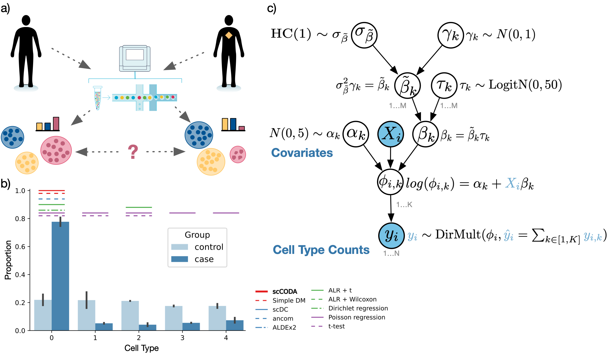

# scCODA - Single-cell differential composition analysis 
scCODA allows for identification of compositional changes in high-throughput sequencing count data, especially cell compositions from scRNA-seq.
It also provides a framework for integration of cell-type annotated data directly from [scanpy](https://scanpy.readthedocs.io/en/stable/) and other sources.
Aside from the scCODA model (Büttner, Ostner *et al* (2021)), the package also allows the easy application of other differential testing methods.

The statistical methodology and benchmarking performance are described in:
 
Büttner, Ostner *et al* (2021). **scCODA is A Bayesian model for compositional single-cell data analysis**
([*Nature Communications*](https://www.nature.com/articles/s41467-021-27150-6))

Code for reproducing the analysis from the paper is available [here](https://github.com/theislab/scCODA_reproducibility).

For further information on the scCODA package and model, please refer to the 
[documentation](https://sccoda.readthedocs.io/en/latest/) and the 
[tutorials](https://github.com/theislab/scCODA/blob/master/tutorials).

## Installation

Running the package requires a working Python environment (>=3.8).

This package uses the `tensorflow` (`>=2.4`) and `tensorflow-probability` (`>=0.12`) packages.
The GPU computation features of these packages have not been tested with scCODA and are thus not recommended.
    
**To install scCODA via pip, call**:

    pip install sccoda

**To install scCODA from source**:

- Navigate to the directory that you want to install scCODA in
- Clone the repository from Github (https://github.com/theislab/scCODA):

    `git clone https://github.com/theislab/scCODA`

- Navigate to the root directory of scCODA:

    `cd scCODA`

- Install dependencies::

    `pip install -r requirements.txt`

- Install the package:

    `python setup.py install`

**Docker container**:

We provide a Docker container image for scCODA (https://hub.docker.com/repository/docker/wollmilchsau/scanpy_sccoda).

## Usage

Import scCODA in a Python session via:

    import sccoda

**Tutorials**

scCODA provides a number of tutorials for various purposes. Please also visit the [documentation](https://sccoda.readthedocs.io/en/latest/) for further information on the statistical model, data structure and API.

- The ["getting started" tutorial](https://sccoda.readthedocs.io/en/latest/getting_started.html) provides a quick-start guide for using scCODA.

- In the [advanced tutorial](https://sccoda.readthedocs.io/en/latest/Modeling_options_and_result_analysis.html), options for model specification, diagnostics, and result interpretation are disccussed.

- The [data import and visualization tutorial](https://sccoda.readthedocs.io/en/latest/Data_import_and_visualization.html) focuses on loading data from different sources and visualizing their characteristics.

- The [tutorial on other methods](https://sccoda.readthedocs.io/en/latest/using_other_compositional_methods.html) explains how to apply other methods for differential abundance testing from within scCODA.

