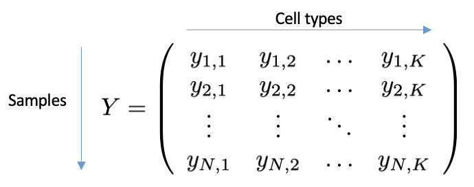

Data structure
==============

Annotating the cells from a biological sample with individual types, e.g. via clustering methods, and grouping them by cell type,
results in a vector of counts (of dimension *K*), with each entry representing a cell type. A scCODA dataset aggregates *N* cell count
vectors as the rows of a matrix of dimension *NxK*, the so-called **cell count matrix** *Y*. The cell count data does not
need to be normalized, as scCODA works on the integer count data.
In addition to the cell counts, scCODA also requires covariates that contain information about each sample.
These can be indicators for e.g. diseases, or continuous variables, such as age or BMI. The *D* covariates for an
scCODA dataset are described by the (*NxK* dimensional) **covariate matrix** *X*.

scCODA uses the `anndata <https://anndata.readthedocs.io/en/latest/index.html>`_ format to store compositional datasets.
Hereby, ``data.X`` represents the cell count matrix, and ``data.obs`` the covariates (The actual covariate or design matrix is generated when calling a model).
The ``data.var`` and ``data.uns`` elements are currently not used.

.. image:: https://falexwolf.de/img/scanpy/anndata.svg
   :width: 500px
   :align: center

Data generation methods
^^^^^^^^^^^^^^^^^^^^^^^

``sccoda.util.data_generation`` contains methods to generate compositional data with different properties that mimics
the properties of scRNA-seq datasets.

Data import methods
^^^^^^^^^^^^^^^^^^^

``sccoda.util.cell_composition_data`` contains methods to import count data from various sources into the data structure used by scCODA.
You can either import data directly from a pandas DataFrame via ``from_pandas``, or get the count data from single-cell expression data used in `scanpy <https://scanpy.readthedocs.io>`_.
If all cells from all samples are stored in one anndata object, ``from_scanpy`` generates a compositional analysis dataset from this.
If there is one anndata object with the single-cell expression data for each sample,
``from_scanpy_list`` (for in-memory data) and ``from_scanpy_dir`` (for data stored on disk) can transform the information from these files directly into a compositional analysis dataset.
For more information, see the data import tutorial.

