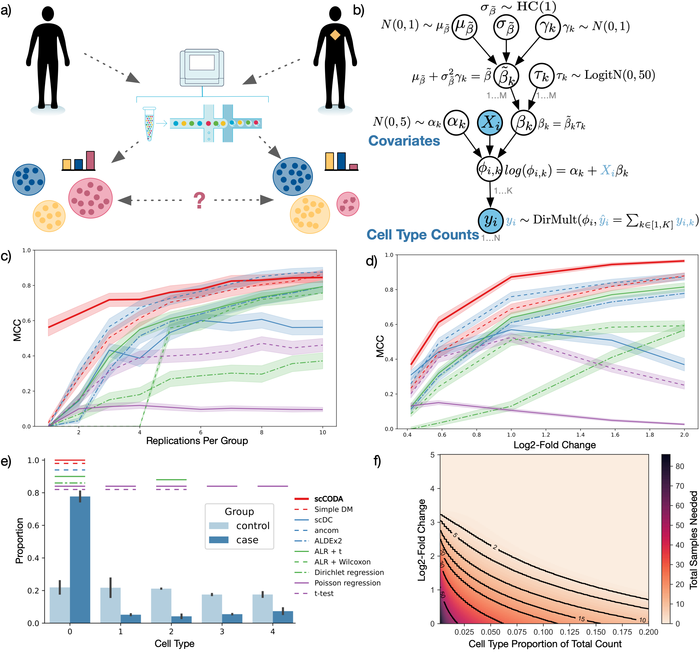

Welcome to scCODA's documentation!
=============================================

scCODA is a toolbox for statistical models to analyze changes in compositional data,
especially from single-cell RNA-seq experiments.
Its main purpose is to provide a platform and implementation for the *scCODA* model, which is described by
`Büttner, Ostner et al. <https://doi.org/10.1101/2020.12.14.422688>`_.

The package is available on `github <https://github.com/theislab/scCODA>`_.

Please also check out the `tutorial <https://github.com/theislab/scCODA/blob/master/tutorials/Tutorial.ipynb>`_
that explains the most important functionalities.

Motivation
^^^^^^^^^^^^

When analyzing biological processes via single-cell RNA-sequencing experiments, it is often of interest to assess how
cell populations change under one or more conditions. This task, however, is non-trivial, as there are several
limitations that have to be addressed:

- scRNA-seq population data is compositional. This must be considered to avoid an inflation of false-positive results.
- Most datasets consist only of very few samples, making frequentist tests inaccurate.
- A condition usually only effects a fraction of cell types. Therefore, sparse effects are preferable.

The scCODA model overcomes all these limitations in a fully Bayesian model, that outperforms other
compositional and non-compositional methods.

scCODA is fully integrable with scanpy_, but provides its own data structure for aggregating, plotting and analyzing
compositional data from scRNA-seq. Additionally to the scCODA model, the package also features a variety of
implementations of other statistical models that can be used as comparisons.

.. toctree::
    :caption: Contents
    :maxdepth: 2

    compositional_data
    data
    models
    installation
    api

.. toctree::
    :caption: Tutorials
    :maxdepth: 1

    getting_started
    Data_import_and_visualization
    Modeling_options_and_result_analysis

Reference
^^^^^^^^^^

Büttner, Ostner *et al.* (2020), scCODA: A Bayesian model for compositional single-cell data analysis
`BioRxiv <https://www.biorxiv.org/content/10.1101/2020.12.14.422688v1>`_.
|dim|

Indices and tables
^^^^^^^^^^^^^^^^^^^^^^

* :ref:`genindex`
* :ref:`modindex`
* :ref:`search`

.. _scanpy: https://scanpy.readthedocs.io

.. |dim| raw:: html

   
   

